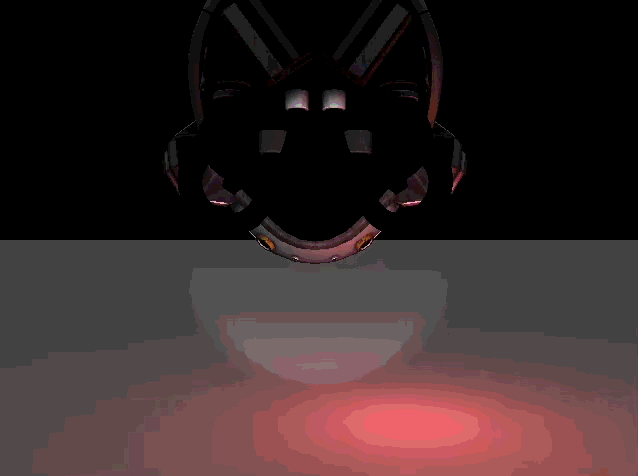

# Falcon-PBR (OpenGL Renderer)
### What
An educational **OpenGL renderer** that loads **glTF/GLB** models, supports a free-fly camera, and renders with **Phong lighting**. It’s a minimal foundation for real-time rendering; PBR is planned next.
### Why
Learn modern graphics by building the pipeline end-to-end: asset loading → GPU buffers → shaders → realtime interaction.
Goal: grow this into a small PBR renderer (Cook–Torrance, IBL, HDR tonemapping).

# Demo
  
> **Warninig**: due to the nature of GIFs the quality is subpar  
> **Features in Demo**: Here you can see phong lighting with different lightcasters, such as point, directional, and spotligt. As well as popular gltf asset DamagedHelmet.

# Features
**Model loading**: glTF/GLB meshes (positions, normals, UVs)
**Camera**: first-person free-fly (mouse look + WASD-style movement)
**Lighting**: per-fragment Phong (ambient + diffuse + specular)
**Textures**: base color (albedo) sampling
**Core renderer loop**: depth testing, back-face culling, basic frame timing
>Intentionally small since the main goal is to learn computer graphics topics, not to be a full engine.

# Requirements and Dependencies
> ⚠️ Compatibility
> This project requires OpenGL 4.2+ (core profile). Machines limited to OpenGL ≤ 4.1 are not supported.
* **C++17**, **CMake**
* **OpenGL 4.2+** context (UBOs + features as used here)
* Window/context & input: **GLFW**
* GL loader: **GLAD**
* Math: **GLM**
* glTF parsing: **TinyGLTF**
* Image I/O: **stb_image**
## Known (in)compatibility
* **Windows + NVIDIA/AMD** drivers: usually is OK (GL 4.2+)
* **macOS (Intel & Apple Silicon)**: **Not** supported (Apple caps OpenGL at 4.1)

# Build
Clone and build with **Cmake**
```
git clone https://github.com/SoMZeY/Falcon-PBR.git
cd Falcon-PBR
mkdir build && cd build
cmake .. -DCMAKE_BUILD_TYPE=Release
cmake --build . --config Release
```

# Run
```
./FalconPBR
```
## Controls (default)
* **Mouse**: look
* **W/A/S/D**: move
* **Space / Ctrl**: up/down
* **Esc**: quit

# Notes / Limits (updated)
* Currently **Phong** shading only (PBR not implemented yet)
* Requires **OpenGL 4.2+**; **macOS** is not supported (OpenGL 4.1 limit)
* Assumes models provide normals and UVs for correct lighting/texture

## License
This project is licensed under the [MIT License](./LICENSE).
